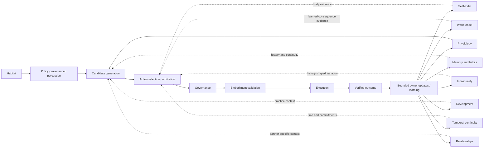

# UMBRA-CORE

UMBRA-CORE is a standalone, persistent autonomous-organism core for digital
companions. It is designed so behavior arises from internal regulation,
perception, learned causal models, verified consequences, memory, development,
relationships, individuality, temporal context, and environmental opportunity—not
from a chatbot loop or a scripted persona.

## Current status: AS-008 protocol terminal

The latest governed generation, AS-008, is permanently terminal at
`AS008_PROTOCOL_FAIL`. Its pre-formal gates passed, then one frozen fresh
population command completed R0 and R1 (`16` organisms, `115200` completed
ticks). The first R2 case created one additional organism and advanced `2399`
ticks before the inherited D-014 harness attempted direct partner occlusion
while HabitatEngine was attached; the sole-writer guard correctly rejected that
mutation. This is a protocol failure, not an integrated-viability result.

No repair, retry, reseed, R3 case, lifecycle, long-horizon, soak, or causal
ablation gate ran. The completed-run record is `16/32`; total created organisms
and executed ticks, including the partial R2 case, are `17/117599`. Integrated
long-horizon viability remains **NOT QUALIFIED**, planning authority remains
unqualified, and CLOSE-03 remains blocked. See the [AS-008 evidence guide
entry](docs/EVIDENCE_GUIDE.md#as-008) and [task packet](.agent/tasks/active/UMBRA-AS-008/RESULT.md).

The latest integrated generation, AS-004, is **terminally failed at its known
historical viability blocker**. Diagnostic A (`500/500`) and Diagnostic B
(`3500/3500`) completed, but the required R1/S16 seed `57531938` reached
`NO_SAFE_ACTION` at tick `1928` and a critical terminal failure at tick `1929`.
Per the frozen stop rule, no fresh population or downstream viability gates ran.
Integrated long-horizon viability remains unqualified.

**Scientific status:** subsystem capabilities are qualified within explicit
boundaries; integrated long-horizon viability is **not qualified**. R6B is a
permanent negative generation, while the fresh R6B-R1 repair qualified a bounded
default-off verified route-control learning primitive: same-target `ORIENT` is
retained in route experience without becoming planning or action-selection
authority. R6C then qualified an additive, shadow-only planning-frame projection
for that route evidence and learned active affordances; it grants no planning or
action-selection authority.

AS-004's bounded source-backed multi-step continuation relation was implemented
behind an explicit opt-in configuration seam and then tested at the authorized
scientific boundary. The implementation is preserved as terminal evidence; the
R1 viability failure means it is **not qualified** as integrated viability or
planning authority.

[Project goal](.agent/PROJECT_GOAL.md) ·
[Current governed state](.agent/CURRENT.md) ·
[Evidence guide](docs/EVIDENCE_GUIDE.md) ·
[Reference architecture](docs/architecture/UMBRA_REFERENCE_ARCHITECTURE.md)

## Why this project exists

A believable persistent digital companion requires more than an LLM, a persona
prompt, a renderer, a scalar mood variable, or a scripted virtual pet. The harder
engineering problem is maintaining one causally coherent individual through time,
restart, learning, incomplete knowledge, relationships, competing internal needs,
changing environments, and changing bodies.

UMBRA explores that problem as an organism core: an autonomous runtime with explicit
state ownership, bounded learning, governed action, verified outcomes, durable
history, and evidence-limited claims.

## What UMBRA is not

UMBRA is not:

- an LLM agent or chatbot;
- a scripted pet or animation state machine;
- a renderer, avatar application, or robotics stack;
- a scalar mood, affection, loyalty, or survival optimizer;
- a digital chemistry, protocell, or biological-cell simulator;
- a claim of consciousness, sentience, emotion, or literal biological life.

Language, rendering, sensors, and physical or virtual bodies may surround the core,
but they must not become authoritative over organism identity, physiology, memory,
decision-making, or verified experience.

## Architecture

UMBRA separates the path that can authorize action from the internal systems that
supply state, evidence, and learned context. Those systems are causally relevant,
but they do not independently execute actions.



The central authority sequence is implemented in the runtime, arbitration,
governance, embodiment, persistence, and verified-outcome paths under
[`umbra_core/`](umbra_core/). The documents in [`docs/architecture/`](docs/architecture/)
describe the frozen foundation and should be read with the later result lineage in
the [evidence guide](docs/EVIDENCE_GUIDE.md); they are not a substitute for current
source and closeout records.

## Architectural principles

- **Persistent constitutional identity.** The organism remains the same individual
  across restart, migration, compatible body changes, and bounded true physical-body
  replacement.
- **Homeostatic regulation.** Physiology owns interacting regulatory state; other
  modules cannot write it directly.
- **Endogenous action.** Candidates arise from organism state, learned history, and
  current opportunity rather than direct user commands.
- **One governed authority path.** Candidate generation, selection, governance,
  embodiment validation, execution, verification, and learning remain distinct.
- **Learned SelfModel and WorldModel.** Body capability and environmental consequence
  models are revisable evidence, not self-authorizing truth.
- **Verified-consequence learning.** Proposals, denied actions, imagined futures, and
  renderer output do not count as lived outcomes.
- **Bounded history.** Memory, habits, development, relationships, and individuality
  are selective, provenance-bearing, and constrained in state and compute.
- **Temporal and habitat continuity.** Restart reconciliation preserves durable time
  and world relationships without fabricating unobserved experience.
- **Body independence.** A body is part of current experience, not constitutional
  organism identity.
- **Expression without control.** Renderers and optional language may express
  read-only state but may not become the organism's controller.
- **Reproducible but not mechanically identical.** Constitutional and persisted state
  are replayable; bounded stochasticity may contribute individuality where explicitly
  qualified.

## Current claim status

Statuses below are intentionally bounded. “Qualified” means the cited experiment or
contract passed its preregistered evidence boundary—not that the entire organism is
solved.

| Capability / property | Status | Evidence boundary |
|---|---|---|
| Persistent identity, autonomous runtime, and homeostasis | **QUALIFIED — bounded** | D-001 invariant companion-core qualification; not a long-horizon integrated viability claim. |
| Sensorimotor SelfModel | **QUALIFIED — bounded** | D-002 functional qualification plus separate D-002P performance remediation. |
| Predictive WorldModel | **QUALIFIED — bounded** | D-003 learned prediction/revision/planning-proposal evidence; not current planner authority. |
| Intrinsic development | **QUALIFIED — bounded** | D-004 competence, practice, satiation, and boundedness gates. |
| Selective long-term memory | **QUALIFIED — bounded** | D-005 episodic, semantic, procedural, consolidation, forgetting, and replay gates. |
| Partner-specific relationships | **QUALIFIED — bounded** | D-006 social contingency and history-dependent behavior. |
| Lived individuality | **QUALIFIED — bounded** | D-007 history-dependent divergence under controlled cohorts. |
| Coherent embodiment | **QUALIFIED — bounded** | D-008 body binding, profile transition, renderer separation, restart, and performance. |
| Persistent habitat agency | **QUALIFIED — bounded** | D-009 habitat authority, manipulation, persistence, and migration gates. |
| Temporal continuity | **QUALIFIED — current baseline** | D-010Q5 qualified the current baseline separately; earlier D-010 failures remain permanent. |
| Governed perception adapters | **QUALIFIED — bounded** | D-011 policy/provenance, rejection durability, replay, and boundedness. |
| True physical-body replacement | **QUALIFIED — bounded** | AS-003S atomic replacement transaction; see below. |
| Verified route-control learning | **QUALIFIED — bounded** | AS-003P-R6B-R1: one frozen nominal route-control acquisition plus one movement-slip failure leg; default-off, WorldModel-owned, no policy reader. |
| Route/affordance planning-frame projection | **QUALIFIED — bounded, shadow-only** | AS-003P-R6C: immutable V2 projection of exact V2 route experience and learned ACTIVE `inspect` affordances; historical route evidence is MAY-only and has no modal/action-selection reader. |
| MAY-route L2 relation reachability | **BOUNDARY FINDING — no precedence** | AS-003P-R6D: open-world route evidence produced `COMPLETE_MAY` versus `SCHEDULE_UNKNOWN` distinctions, but zero route-causal L2 precedence cases; R7 remains blocked. |
| Known recovery-option preservation relation | **BOUNDED RESEARCH PRIMITIVE — matrix claim rejected for R7** | AS-003P-R6E's pure relation remains supported, but R6E-R1 found its R6D projection did not establish a lawful pre-candidate common-root option set; R7 remains blocked. |
| Prospective common-root recovery-option acquisition | **R6F FAILED — protocol only; R6F-R1 NON-DISCRIMINATING** | R6F stopped before `main()` on an import error. Fresh R6F-R1 passed twice-identical executable preflight and acquired one pre-root V2 route, but both frozen ordinary candidates preserved the option; no strict R6E relation or R7 authority was established. |
| Ordinary action selection and modal planning | **ACTIVE RESEARCH QUESTION** | Prior scalar and strict-dominance selectors were insufficient; modal planning remains shadow-only and has no behavior authority. |
| Integrated long-horizon viability | **NOT QUALIFIED** | Formal and long-horizon generations retain terminal failures; AS-004 and CLOSE-03 remain blocked. |

Detailed verdicts, manifests, and negative lineages are indexed in
[`docs/EVIDENCE_GUIDE.md`](docs/EVIDENCE_GUIDE.md).

## Recent result: atomic body replacement

AS-003S qualified a bounded true physical-body replacement transaction. The
implementation:

- preserves constitutional agent and lineage identity;
- mints a distinct physical `body_instance_id`;
- creates a new SelfModel body binding and schema;
- keeps EmbodimentAdapter and Embodiment occupancy coherent;
- commits one `embodiment_body_replaced` event and its prospective full snapshot in
  one SQLite transaction before applying live owner state;
- rolls back fully on pre-commit injection and recovers exactly after a
  commit-before-live-apply interruption;
- rejects stale body references, pending execution, and replacement while the old
  body holds an object;
- preserves memory, relationships, individuality, restart continuity, and later
  compatible profile-swap semantics.

The bounded lifecycle qualification performed one creation and one restart load with
zero organism ticks. Separate focused tests do exercise `tick_once()`; “zero ticks”
does not describe the entire test campaign. Focused AS-003S proofs passed `14/14`,
and baseline comparison found zero candidate-only failures in the applicable suite.

[AS-003S result](.agent/tasks/active/UMBRA-AS-003S/RESULT.md) ·
[validation summary](.agent/tasks/active/UMBRA-AS-003S/AS003S_VALIDATION_SUMMARY.json) ·
[crash-consistency proof](.agent/tasks/active/UMBRA-AS-003S/AS003S_CRASH_CONSISTENCY_PROOF.json) ·
[manifest](.agent/tasks/active/UMBRA-AS-003S/AS003S_EVIDENCE_MANIFEST.json)

## Recent result: same-target route-control learning

R6B-R1 repaired and freshly qualified the narrow route-experience boundary that
R6B exposed. A verified target-bound `ORIENT` now preserves continuity for the
same exact WorldModel opportunity and body schema, while its issue/completion
timing and provenance are retained as an ordered non-translational control step.
Verified translational `APPROACH` count remains separate. Unbound actions,
route switches, ambiguity, body changes, denials, and unverified outcomes still
fail closed; issued `IDLE` is an interruption.

The frozen assay acquired a nominal sequence containing three `ORIENT` steps,
one successful `APPROACH`, and terminal `CHARGE`, plus a separate verified
`movement_slip` failure leg. This is bounded route-learning evidence, not a
route planner, action-selection change, or integrated viability result. The
historical R6B failure remains permanent and is not rewritten.

[R6B-R1 task packet](.agent/tasks/active/UMBRA-AS-003P-R6B-R1/RESULT.md) ·
[R6B-R1 evidence guide entry](docs/EVIDENCE_GUIDE.md#as-003p-r6b-r1)

## Recent result: route and affordance planning-frame projection

AS-003P-R6C qualified an additive `AS003P_PLANNING_EVIDENCE_FRAME_V2` projection
without changing route learning, modal semantics, candidate generation, or
action-selection authority. A successful V2 route experience is joined only by
exact opportunity identity, body schema, and terminal capability; its ordered
verified control steps, observed duration, movement count, timing, and provenance
are exposed as `VERIFIED_OBSERVED_SUPPORT` with modality `MAY`. Failure history is
retained separately and cannot imply a future impossibility. V1 records remain
readable but are never upgraded with invented control steps.

The same frame can expose a policy-visible opportunity's learned `ACTIVE` inspect
affordance as `MAY`. Fixed authored priors, missing instances, weakened or
superseded beliefs, and unsupported joins remain `UNKNOWN`. The new fields are
deeply immutable, source-fingerprinted, bounded, deterministic, and ignored by
the existing modal evaluator; static analysis found zero readers in candidate
generation, arbitration, Governance, Embodiment, or planning/action-selection
authority. This is a planning-evidence substrate result, not a planner or
behavioral qualification.

[R6C result](.agent/tasks/active/UMBRA-AS-003P-R6C/RESULT.md) ·
[R6C evidence guide entry](docs/EVIDENCE_GUIDE.md#as-003p-r6c)

## R6D: MAY-route reachability boundary

R6D is a zero-run architecture audit, not a qualification or implementation
repair. It preserved the R6 `l2_precedes()` relation and compared a diagnostic
closed-world interpretation with the lawful open-world interpretation of R6C's
MAY-only route witnesses. The deterministic matrix covered 1,152 symbolic
configurations.

Under open-world semantics, a finite successful route witness can establish
`COMPLETE_MAY_SCHEDULE`, but a witness that misses a deadline leaves an unobserved
faster route as residual `SCHEDULE_UNKNOWN`. It therefore cannot establish the
`NO_COMPLETE_SCHEDULE` obligation needed for route-informed precedence. The matrix
found zero open-world route-causal precedence cases, 96 `COMPLETE_MAY` versus
`SCHEDULE_UNKNOWN` evidence distinctions, 288 non-route-causal precedence cases,
and 576 cases preempted by hard authority. The 96 route-causal positives exist
only in an explicitly non-authoritative closed-world diagnostic.

Terminal result: `AS003PR6D_ROUTE_EVIDENCE_DISTINCTION_WITHOUT_PRECEDENCE`.
R7's currently specified common-root precedence target is not justified, and no
successor has started. See the [R6D result](.agent/tasks/active/UMBRA-AS-003P-R6D/RESULT.md)
and [R6D evidence guide entry](docs/EVIDENCE_GUIDE.md#as-003p-r6d).

## R6E: known recovery-option preservation

R6E is a zero-organism relation study prompted by R6D's open-world boundary. It
keeps a fixed common root set of known source-backed recovery options and gives
each candidate one of three statuses: `PRESERVED`, `DESTROYED`, or `UNKNOWN`.
Unknown is never treated as loss. The relation therefore says only that a
candidate B destroys a known option that candidate A preserves; it does not say
that B is unrecoverable, unsafe, suboptimal, or without an unobserved future
route.

The historical projection reported 192 positive relations, including 64
route-causal ordinary hard-admissible cases. R6E-R1 then audited that projection
without changing it and found that all 512 nonempty projected root options were
constructed using synthetic `route_case` data that also controlled B-specific
route evidence; the remaining 640 rows had no constructible root option. Thus
the pure relation remains a bounded research primitive, but the R6D-derived
matrix positives are not accepted as common-root evidence or R7 authority.

Terminal result: `AS003PR6E_KNOWN_RECOVERY_OPTION_PRESERVATION_RELATION_SUPPORTED`
for the pure relation only. See the [R6E result](.agent/tasks/active/UMBRA-AS-003P-R6E/RESULT.md)
and [R6E evidence guide entry](docs/EVIDENCE_GUIDE.md#as-003p-r6e).

## R6E-R1: common-root provenance requalification

R6E-R1 is a zero-run audit of the immutable R6D-to-R6E projection. Its locked
rule is `O0 = f(common-root source evidence only)`: candidate consequences may
change option status, but cannot create or alter root option identity/support.
No R6D field consumed by the old projection is established as common-root
evidence. The retained seven-tick witness is historical MAY evidence but has no
documented pre-candidate source chain in the R6D matrix, and the generic
`nonroute_known_impossibility` label supplies no dependency-specific edge.

Terminal result: `AS003PR6ER1_CANDIDATE_DERIVED_ROOT_CONTAMINATION_CONFIRMED`.
The provenance-safe reapplication found 0 lawful common-root rows and 0
positive relations; R7 remains blocked. See the [R6E-R1 task packet](.agent/tasks/active/UMBRA-AS-003P-R6E-R1/RESULT.md)
and [R6E-R1 evidence guide entry](docs/EVIDENCE_GUIDE.md#as-003p-r6e-r1).

## R6F: prospective common-root acquisition

R6F was authorized to acquire one real verified route experience and then
evaluate a predeclared ordinary `IDLE`/`MOVE` pair from a later common root.
Its static Phase B/C gates passed using existing policy-visible recoverability,
exact opportunity identity, and body-schema evidence. The single frozen module
invocation then failed before `main()` because the research harness imported
`canonical_fingerprint` from the wrong module. No organism was created and no
tick or relation evaluation occurred. Under the frozen protocol, this is a
permanent `AS003PR6F_PROTOCOL_FAIL`; it is not a production or scientific
rejection. See the [R6F result packet](.agent/tasks/active/UMBRA-AS-003P-R6F/RESULT.md)
and [R6F evidence guide entry](docs/EVIDENCE_GUIDE.md#as-003p-r6f).

## R6F-R1: prospective common-root acquisition after protocol repair

R6F-R1 corrected only the two identified research-harness imports and froze the
same R6F scientific protocol: S0, seed `18482`, 500-tick cap, the ordinary
`IDLE`/`MOVE` pair, and the pre-root known-option predicate. Complete executable
preflight passed twice identically. The one permitted organism run acquired a
verified V2 route at tick 3 before root tick 4 with exact opportunity/body-schema
applicability. Both candidates were emitted and hard-admissible, but the actual
root margin was preserved by both; `MOVE` did not categorically destroy the
known option. The terminal result is
`AS003PR6FR1_PROSPECTIVE_COMMON_ROOT_RELATION_NONDISCRIMINATING`, not a
production or planning qualification. R7 remains blocked. See the [R6F-R1
result packet](.agent/tasks/active/UMBRA-AS-003P-R6F-R1/RESULT.md) and [R6F-R1
evidence guide entry](docs/EVIDENCE_GUIDE.md#as-003p-r6f-r1).

## Scientific method

UMBRA treats experiment design and negative evidence as part of the implementation:

- contracts, commands, thresholds, and stop conditions are preregistered or locked
  before qualification when the stage requires it;
- frozen failures terminate their generation—there is no post-hoc threshold
  weakening or silent retry;
- failed and inconclusive generations remain permanent evidence;
- formal qualification, bounded mechanism evidence, diagnostics, and static proofs
  are labeled separately;
- a passing test only supports the property it actually exercises;
- single seeds and demonstrations do not establish general viability;
- evidence artifacts use manifests, SHA-256 inventories, durable publication, and
  readback verification where required;
- current claims are reconciled across strategic authority, committed source, and
  retained execution evidence.

The repository's internal Authority 3.0 records live under [`.agent/`](.agent/) and
the active workflow is described by [`AGENTS.md`](AGENTS.md). These are governance
and provenance surfaces, not the recommended first entrypoint for understanding the
software.

## Selected negative results

Negative results are not removed when later work succeeds.

- **Temporal continuity:** historical D-010 performance generations failed. The
  current baseline was qualified later as a separate D-010Q5 generation rather than
  relabeling the old evidence.
- **Formal autonomy:** D-012B2 failed its remediated formal P0 when energy crossed the
  critical bound at tick 181. The broader D-012 viability claim remains unqualified.
- **Long-horizon viability:** D-014E1 completed eight fixed R0 runs but the
  preregistered R1 seed failed at tick 372 with critical fatigue; later populations
  were not run after the terminal stop.
- **Action selection:** AS-003C observed 2,647 qualifying ordinary multi-candidate
  decisions with zero supported-dominance eliminations and full-frontier saturation.
  AS-003D retired that strict-dominance architecture as a forward selector.
- **Route learning:** R6B's nominal leg failed when same-target `ORIENT` was treated
  as an unrelated interruption. R6B-R1 qualified the bounded repair while preserving
  the original failure as permanent evidence.
- **Observer measurement:** AS-003P/R1/R3 generations exposed import-protocol,
  comparator, and cross-run body-identity equivalence defects. Their raw modal traces
  were not promoted to qualified planning evidence. The body-identity defect found in
  that lineage led to the separately qualified AS-003S repair. AS-003P-R5 then created
  its one permitted zero-tick common root but stopped before forking because its frozen
  harness parsed a raw SQLite snapshot ID as JSON; no control/shadow branch ran.
  AS-003P-R5A separately reused that retained root under a new lock and established
  observer parity, but its fresh modal profiles supplied no candidate distinction,
  including across 57 relevant conflict exposures.
- **Open-world planning reachability:** AS-003P-R6D preserved the L2 relation and
  showed that MAY-only route experience can distinguish a possible schedule from an
  unknown schedule, but cannot prove route-informed loss under open-world
  semantics. The route-causal positives in its closed-world projection are
  diagnostic only; R7 remains on hold.

See [Selected negative evidence](docs/EVIDENCE_GUIDE.md#selected-negative-evidence)
for the exact records.

## Repository map

| Path | Purpose |
|---|---|
| [`umbra_core/`](umbra_core/) | Production organism core and owner modules. |
| [`tests/`](tests/) | Focused, regression, governance, and experiment-support tests. Some tests instantiate or tick organisms. |
| [`experiments/`](experiments/) | Diagnostic, preregistered, qualification, and retained-evidence harnesses. Read each stage contract before execution. |
| [`docs/architecture/`](docs/architecture/) | Frozen foundation architecture and authority references. |
| [`docs/evidence/`](docs/evidence/) | Committed historical result artifacts and verdicts. |
| [`research/`](research/) | Non-production research and course-correction tooling. |
| [`tools/`](tools/) | Governance, evidence, analysis, and bounded validation tools. |
| [`.agent/`](.agent/) | Internal source-of-truth router, current status, append-only outcomes, learnings, and task packets. |

## Local inspection and validation

The repository is Python and is currently exercised in place; [`pytest.ini`](pytest.ini)
adds the repository root to Python's import path. There is **no canonical root
`pyproject.toml`, requirements file, lockfile, or packaged installation procedure**.
Python and tool dependencies are therefore not yet presented as a reproducible public
bootstrap contract.

With a compatible Python environment in which `pytest` is already installed, focused
entrypoints include:

```bash
python3 -m pytest tests/test_as003s_body_replacement.py -q
python3 scripts/validate_authority_v3.py
python3 scripts/validate_governance.py --mode ADOPTED
```

These commands validate specific surfaces; they are not a substitute for a frozen
experiment protocol. Do not run an experiment merely because its module exists.
Historical harnesses carry stage-specific seeds, evidence roots, stop rules, and
authorization boundaries.

The repository does not currently claim a globally green full suite. At the AS-003S
closeout:

- focused AS-003S: `14 PASS / 0 FAIL`;
- D-002: `53 PASS / 1 inherited exact-baseline FAIL`;
- D-008/D-009: `202 PASS / 1 inherited D-009 FAIL / 2 SKIP`;
- path-safe applicable suite: `1120 PASS / 14 inherited FAIL / 2 SKIP`;
- candidate-only failures: `0`.

The raw full-suite collector also encounters an inherited orphan test import. These
results are evidence-accounting facts, not an “all tests passing” claim.

No root license is currently published. Treat the repository as available for review,
not as granting reuse rights, unless a license is added separately.

## Current research frontier

### AS-006 — executable weak-continuation loss (pre-scientific)

AS-006 is now terminal at `AS006_KNOWN_R1_FAIL`. Diagnostic A and B completed
their frozen horizons, while the known R1/S16 leg stopped at tick `1929` after
`NO_SAFE_ACTION` at `1928` and verified `REST/not_at_rest`. The bridge remains
terminal evidence rather than qualified planning authority, and integrated
long-horizon viability is still unqualified. See the [AS-006 result](.agent/tasks/active/UMBRA-AS-006/RESULT.md).

AS-006 is a fresh implementation generation following the permanent protocol
terminal `AS005_PROTOCOL_FAIL`. It adds exact lived-option identity,
candidate-caused `PRESERVED / DESTROYED / UNKNOWN` status per supported branch,
and preventive activation from source-derived option demand. Focused proofs pass
`17/17` twice; a fresh source-activation run completed `500/500`; and a fresh
common-root observer gate passed with one control and one shadow branch at
`500/500`, zero semantic differences, and exact RNG parity. The scientific
Diagnostic A/B/R1 sequence has not yet run, so this is not a qualification or
integrated-viability claim. Planning remains non-authoritative.

The body-replacement identity defect is closed within the AS-003S boundary. Bounded
hypothetical-state and modal-planning infrastructure exists, remains shadow-only, and
has not earned live action-selection authority.

AS-003P-R5A completed a prospectively locked common-root comparison from R5's retained
tick-0 state. One 500-tick CONTROL and one 500-tick SHADOW branch were semantically
equal across action timeline, candidate identities, authoritative events, final state,
Habitat, and RNG. This establishes observer-safe evidence acquisition for that pair.
The fresh shadow trace produced 500 complete frames and 2,686 candidate profiles, but
zero candidate-profile distinctions—including across 57 decisions exposing the
AS-003L residual conflict class. The terminal result is therefore
`AS003PR5A_OBSERVER_SAFE_MODAL_EVIDENCE_NONDISCRIMINATING`, not a planning
qualification.

AS-003P-R6 then examined those immutable traces without another organism run. It
confirmed that the top-level modal labels compress materially different immediate
consequences, but also found that the trace never retained source-backed route/service
demand. Under the preregistered AS-003L schedulability contract, all 5,323 admitted
modal witnesses therefore remain timing-unknown and no L2 candidate relation can be
supported. The terminal result is
`AS003PR6_SOURCE_EVIDENCE_INSUFFICIENT_FOR_L2`; it grants no planning authority.

R6A subsequently established that the missing route demand is not a lawful geometric
source join: radial opportunity distance and historical APPROACH support do not by
themselves form a guaranteed traversable route envelope. Its terminal result is
`AS003PR6A_ROUTE_DEMAND_LEARNING_PRIMITIVE_REQUIRED`. R6B is the bounded next step:
learn opportunity- and body-schema-bound route experience only from verified
execution outcomes, with no reader in action selection or planning. R6B is
permanently failed; R6B-R1 subsequently qualified same-target route-control
continuity. R6C now projects that qualified V2 evidence and learned ACTIVE
affordances into an immutable shadow frame, but the fields remain MAY/UNKNOWN
evidence and are not consumed by action selection.

R6D then audited whether those MAY-only route witnesses can reach the locked L2
precedence relation. It found that open-world residual UNKNOWN blocks a route-derived
no-schedule proof, while route evidence still creates non-authoritative
`COMPLETE_MAY` versus `SCHEDULE_UNKNOWN` distinctions. The terminal result is
`AS003PR6D_ROUTE_EVIDENCE_DISTINCTION_WITHOUT_PRECEDENCE`; R7 is not authorized.

R6E then tested a weaker known-option preservation relation over the same frozen
symbolic evidence. Its pure relation remains supported, but R6E-R1 found that
the matrix projection had not established a pre-candidate common-root option
set. The R6E-R1 terminal result is
`AS003PR6ER1_CANDIDATE_DERIVED_ROOT_CONTAMINATION_CONFIRMED`; R7 remains blocked
and unstarted.

### AS-004 bounded continuation and viability

AS-004 implemented a bounded, source-backed AND/OR continuation bridge and one
explicit ordinary action-selection seam. Its pre-scientific gates passed with
`333/333` focused proofs twice, and the applicable regression found `0`
candidate-only failures. The frozen diagnostics then completed A (`500/500`)
and B (`3500/3500`), but the required known R1/S16 run (`57531938`, target
`7200`) failed at tick `1929`: `NO_SAFE_ACTION` began at tick `1928`, followed
by critical fatigue and a verified failed `REST` outcome (`not_at_rest`).

This is a terminal scientific negative result, not a protocol failure. The
frozen sequence stopped exactly there; fresh population, lifecycle, accelerated
100k, real-time soak, and ablation gates were not run. The continuation bridge
recorded an empty common-root option set at every measured continuation decision
in A, B, and R1, with zero eliminations. No planning authority or integrated
viability claim follows.

[AS-004 terminal result](.agent/tasks/active/UMBRA-AS-004/RESULT.md) ·
[validation summary](.agent/tasks/active/UMBRA-AS-004/AS004_VALIDATION_SUMMARY.json) ·
[evidence guide](docs/EVIDENCE_GUIDE.md#as-004-bounded-continuation-and-viability)

AS-004 is terminal at `AS004_KNOWN_R1_FAIL`. Planning authority, integrated
viability, R7, and CLOSE-03 final organism acceptance remain blocked. No
successor has been started.

## Evidence navigation

Start with the [evidence guide](docs/EVIDENCE_GUIDE.md). It separates foundation
architecture, qualified subsystem verdicts, current status, selected negative results,
action-selection/planning research, and local/internal evidence provenance without
requiring access to private project conversations.
